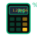
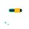
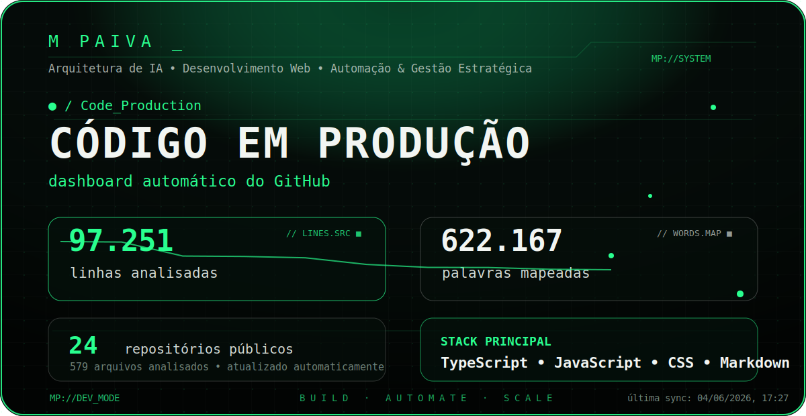
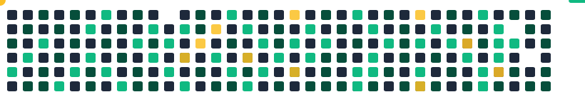

<!-- ╔══════════════════════════════════════════════════════════════╗
     ║  M PAIVA — GitHub Profile README                              ║
     ║  Desenvolvimento Web • IA Aplicada • Automação • SaaS         ║
     ╚══════════════════════════════════════════════════════════════╝ -->

<p align="center">
  
</p>

<p align="center">
  <a href="https://github.com/EoPaiva">
    
  </a>
</p>

<div align="center">

  
  
  

</div>

<h2 align="center">
  <samp>&gt; M_PAIVA_</samp>
</h2>

<p align="center">
  <i>Construindo interfaces, sistemas e produtos digitais com estratégia, performance e propósito.</i>
</p>

<div align="center">

[](https://upaiva.dev/)
[](https://linkedin.com/in/mateus-paiva-19804b284)
[](mailto:mpaiiva21@gmail.com)
[](https://github.com/EoPaiva)

</div>

---

## `whoami.json`

```js
const mateusPaiva = {
  nome:        "Mateus Paiva",
  funcao:      "Desenvolvedor Web • IA Aplicada • Produto Digital",
  baseado:     "São José dos Campos — SP",
  foco:        ["Web Development", "SaaS", "Automação", "UX Estratégica"],
  diferencial: "Tecnologia + estratégia + experiência em soluções claras e escaláveis",
  objetivo:    "Transformar ideias em produtos profissionais, úteis e bem estruturados."
};
```

Perfil híbrido entre **tecnologia, produto, processos e pessoas**. Atuo na criação de interfaces, sistemas, plataformas SaaS e soluções digitais — unindo visão técnica com pensamento estratégico para entregar produtos com clareza, performance e propósito.

---

## `projetos_em_destaque = [`

<table>
  <tr>
    <td width="33%" valign="top">
      <h3> upaiva.dev</h3>
      <p>
        
      </p>
      <p><sub>Portfólio profissional — vitrine digital, branding e posicionamento estratégico.</sub></p>
      <p>
        
        
        
      </p>
      <a href="https://upaiva.dev/">→ ver projeto</a>
    </td>
    <td width="33%" valign="top">
      <h3> InstaGrowth IA</h3>
      <p>
        
        
      </p>
      <p><sub>Extensão Chrome (MV3) de <b>growth para Instagram com IA BYOK</b>. Captura perfis, descobre nichos, executa follow/unfollow com timing humano e gera conteúdo via Claude/OpenAI/Gemini — usuário traz a própria chave.</sub></p>
      <p>
        
        
        
        
        
      </p>
        <a href="https://chromewebstore.google.com/detail/instagrowth-ia-upaiva/eopaifcdlgkmmpemkpkdklhaddgllbkc?hl=pt-br">
          
        </a>
      <details>
        <summary><sub><b>+ detalhes técnicos</b></sub></summary>
        <sub>
          <br>
          ▸ Build com esbuild gerando IIFE bundles (popup, content, background)<br>
          ▸ 2 builds: <code>full</code> (sideload com auto-follow) + <code>lite</code> (Chrome Web Store)<br>
          ▸ BYOK — usuário usa própria API key de Claude, OpenAI ou Gemini<br>
          ▸ Agente <b>local</b> sem tokens pro card "O Que Fazer Agora?"<br>
          ▸ Backend Railway compartilhado com cross-app filter (appId)<br>
          ▸ Automação com timing humano (pacer + safety-guard)<br>
          ▸ 3 planos: 7 dias · 30 dias · Vitalício (compra única, via PIX)<br>
          ▸ Captura, descoberta, fila, growth coach, prompt studio
        </sub>
      </details>
    </td>
    <td width="33%" valign="top">
      <h3> Calc Impostos BR</h3>
      <p>
        
        
      </p>
      <p><sub>Extensão Chrome (MV3) para cálculo automático de <b>impostos brasileiros</b> — IR, INSS, FGTS, salário líquido, MEI, Simples Nacional. Premium com acesso vitalício via PIX.</sub></p>
      <p>
        
        
        
        
        
      </p>
        <a href="https://chromewebstore.google.com/detail/calculadora-de-impostos-b/cifdfcomjlidngiddbdnhmcakecggehh?utm_source=item-share-cb">
          
        </a>
    </td>
  </tr>
  <tr>
    <td width="33%" valign="top">
      <h3> AgendaPro</h3>
      <p>
        
      </p>
      <p><sub>SaaS de agendamento multiempresa — checkout, planos e implantação assistida.</sub></p>
      <p>
        
        
        
      </p>
      <a href="https://agenda-pro-eta.vercel.app/">→ em desenvolvimento</a>
    </td>
    <td width="33%" valign="top">
      <h3> Não Seguidores uPaiva</h3>
      <p>
        
        
      </p>
      <p><sub>Extensão Chrome (MV3) <b>freemium</b> para análise e limpeza inteligente de seguidores no Instagram. Detecta quem não te segue, classifica perfis e faz unfollow em lote com delays seguros. <b>Publicada na Chrome Web Store</b>.</sub></p>
      <p>
        
        
        
        
        
      </p>
      <p>
        <a href="https://chromewebstore.google.com/detail/n%C3%A3o-seguidores-upaiva/pggbblnnnofafnnieccbdopeaaafolin?hl=pt-br">
          
        </a>
      </p>
      <details>
        <summary><sub><b>+ detalhes técnicos</b></sub></summary>
        <sub>
          <br>
          ▸ Popup com 4 abas (Capturar / Análise / Lista / Config)<br>
          ▸ Content script integrado à API interna do Instagram via cookies<br>
          ▸ Auto-injeção via <code>chrome.scripting.executeScript</code><br>
          ▸ Unfollow bulk com delay aleatório 5–11s (anti-detecção)<br>
          ▸ Lista branca + ignorados persistentes<br>
          ▸ Backend Node.js + Supabase + RLS + Mercado Pago<br>
          ▸ Licença vinculada a e-mail · 2 devices · device token
        </sub>
      </details>
    </td>
    <td width="33%" valign="top">
      <h3> CidadeOS AI</h3>
      <p>
        
      </p>
      <p><sub>Plataforma govtech de atendimento, protocolo e inteligência urbana para pequenas cidades.</sub></p>
      <p>
        
        
        
      </p>
      <a href="https://cidade-os-ai.vercel.app/">→ ver projeto</a>
    </td>
  </tr>
  <tr>
    <td width="33%" valign="top">
      <h3> Studio JMarq</h3>
      <p>
        
      </p>
      <p><sub>Site comercial premium — landing page, identidade visual e microinterações.</sub></p>
      <p>
        
        
        
      </p>
      <a href="https://studiojmarq.com/">→ ver projeto</a>
    </td>
    <td width="33%" valign="top">
      <h3> FitPro</h3>
      <p>
        
      </p>
      <p><sub>SaaS de gestão fitness — treinos, alunos, planos e acompanhamento de evolução.</sub></p>
      <p>
        
        
        
      </p>
      <a href="https://fit-pro-xp7c.vercel.app/">→ ver projeto</a>
    </td>
    <td width="33%" valign="top" align="center">
      <br>
      <h3>🚀 &nbsp;Próximo capítulo</h3>
      <p><sub>Novos produtos digitais, IA aplicada e SaaS em construção contínua.</sub></p>
      <br>
      <a href="https://github.com/EoPaiva?tab=repositories">
        
      </a>
      <br><br>
      <a href="https://upaiva.dev/">
        
      </a>
    </td>
  </tr>
</table>

`]`

---

## `stack.config.ts`

```ts
const proficiency = {
  "🟢 production" : "usado em projetos reais entregues — base diária",
  "🟡 fluent"     : "domínio sólido aplicável em produção quando preciso",
  "🔵 expanding"  : "em aprendizado / próxima iteração técnica"
};
```

### `[ Frontend / Interface ]`

<p>
  <strong>🟢</strong>&nbsp;
  
  
  
  
  
  
  
  
</p>
<p>
  <strong>🟡</strong>&nbsp;
  
  
  
  
  
  
  
  
</p>
<p>
  <strong>🔵</strong>&nbsp;
  
  
  
  
  
</p>

<sub>Interfaces responsivas • Dark mode premium • Microinterações • Componentização • Design system • UX estratégica aplicada</sub>

---

### `[ Backend / Dados ]`

<p>
  <strong>🟢</strong>&nbsp;
  
  
  
  
  
  
</p>
<p>
  <strong>🟡</strong>&nbsp;
  
  
  
  
  
  
  
  
</p>
<p>
  <strong>🔵</strong>&nbsp;
  
  
  
  
  
  
</p>

<sub>APIs REST • Autenticação • RBAC • Row Level Security • Storage • Multi-tenant • Variáveis de ambiente • Rate limiting</sub>

---

### `[ AI / Automação ]`

<p>
  <strong>🟢</strong>&nbsp;
  
  
  
  
  
  
  
  
  
  
</p>
<p>
  <strong>🟡</strong>&nbsp;
  
  
  
  
  
  
  
</p>
<p>
  <strong>🔵</strong>&nbsp;
  
  
  
  
  
  
</p>

<sub>IA aplicada multi-provider (BYOK) • Agente local sem tokens • Prompts estratégicos • Automação com timing humano • Integrações externas • Monitoramento</sub>

---

### `[ DevOps / Tooling ]`

<p>
  <strong>🟢</strong>&nbsp;
  
  
  
  
  
  
  
  
  
</p>
<p>
  <strong>🟡</strong>&nbsp;
  
  
  
  
  
  
  
  
</p>
<p>
  <strong>🔵</strong>&nbsp;
  
  
  
  
  
</p>

<sub>CI/CD • Hospedagem serverless • Chrome Web Store deploy • Bundle dual-build (full/lite) • Versionamento • Workflows automatizados</sub>

---

### `[ Produto / Estratégia ]`

<p>
  <strong>🟢</strong>&nbsp;
  
  
  
  
  
  
  
  
  
  
</p>
<p>
  <strong>🟡</strong>&nbsp;
  
  
  
  
  
  
  
  
</p>
<p>
  <strong>🔵</strong>&nbsp;
  
  
  
  
  
</p>

<sub>Arquitetura SaaS • Multi-tenant • Cross-app isolation (appId) • Compra única • Anti-fraude com device tokens • Operação escalável</sub>

---

### `[ // delivered ]`

```ts
const projects_shipped = [
  "upaiva.dev",          // Next.js · Tailwind · Framer Motion
  "InstaGrowth IA",      // MV3 · esbuild · BYOK (Claude/OpenAI/Gemini) · PIX
  "Calc Impostos BR",    // MV3 · Node.js · Supabase · PIX vitalício
  "Não Seguidores",      // MV3 · Node.js · Supabase · PIX freemium
  "AgendaPro",           // Next.js · Supabase · PostgreSQL · Checkout
  "Studio JMarq",        // React · Tailwind · GSAP
  "FitPro",              // Next.js · Supabase · Tailwind
  "CidadeOS AI"          // React · Supabase · WhatsApp API
];
// → 8 produtos entregues · 5 stacks distintas · 3 extensões na Chrome Web Store
// → Backend Railway multi-app compartilhado entre 3 extensões via appId
```

---

## `modos_de_atuacao`

<p align="center">
  
</p>

---

## `como_penso_um_projeto`

<p align="center">
  
</p>

---

## `codigo_em_producao`

<!-- CODE_DASHBOARD:START -->
<p align="center">
  
</p>
<!-- CODE_DASHBOARD:END -->

<p align="center">
  <sub>Painel gerado automaticamente a partir dos repositórios públicos do GitHub — linhas, palavras, arquivos e principais tecnologias em uso.</sub>
</p>

---

## `telemetria_do_github`

<div align="center">

### `[ Activity_Graph ]`


<br><br>

### `[ Stats_&_Streak ]`

<table align="center" border="0" cellpadding="0" cellspacing="6">
  <tr>
    <td align="center" valign="middle">
      
    </td>
    <td align="center" valign="middle">
      
    </td>
  </tr>
</table>

<br>

### `[ Top_Languages_&_Trophy ]`

<table align="center" border="0" cellpadding="0" cellspacing="6">
  <tr>
    <td align="center" valign="middle">
      
    </td>
    <td align="center" valign="middle">
      
    </td>
  </tr>
</table>

<br>

### `[ Productive_Hours ]`

<table align="center" border="0" cellpadding="0" cellspacing="6">
  <tr>
    <td align="center" valign="middle">
      
    </td>
    <td align="center" valign="middle">
      
    </td>
  </tr>
</table>

<br>

### `[ Contribution_Snake ]`



</div>

---

## `status_atual`

```txt
> Construindo presença profissional através de projetos reais.
> Unindo tecnologia, IA aplicada, automação e estratégia digital.
> Evoluindo upaiva.dev, AgendaPro e Studio JMarq com foco em produto, SaaS e experiência.
> Aprendizado contínuo — código, design, gestão e visão de negócio.
```

---

## `contato`

<div align="center">

**Vamos conversar?**

[](https://upaiva.dev/)
[](https://linkedin.com/in/mateus-paiva-19804b284)
[](mailto:mpaiiva21@gmail.com)

</div>

---

<p align="center">
  <samp><i>"A tecnologia só atinge seu ápice quando guiada por estratégia clara, execução consistente e pessoas excepcionais."</i></samp>
</p>

<br>

<p align="center">
  
</p>

<p align="center">
  
</p>
