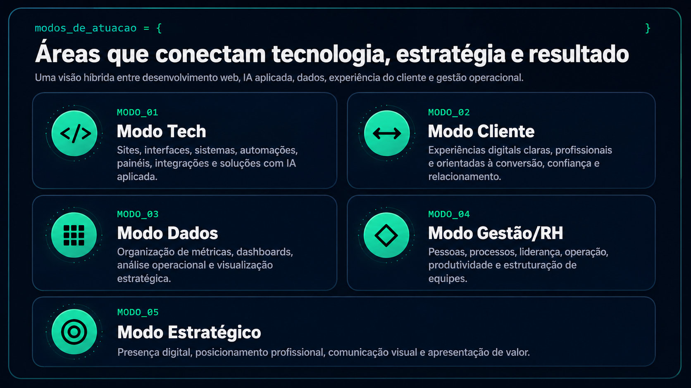
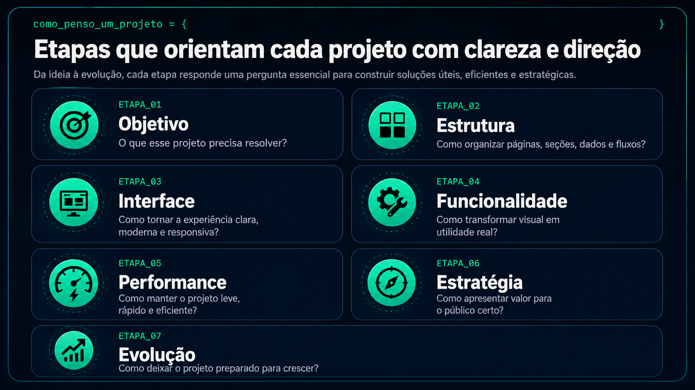
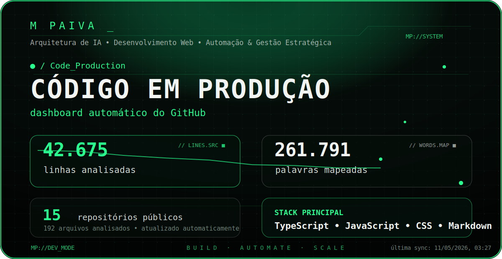

<div align="center">

  

</div>

<br>

<h1 align="center">
  <samp>&gt; [ SISTEMA_ATIVO ]: M PAIVA_</samp>
</h1>

<p align="center">
  <b>Desenvolvimento Web • IA Aplicada • Automação • Soluções Digitais</b>
  <br>
  <i>Construindo interfaces, sistemas e experiências digitais com estratégia, performance e propósito.</i>
</p>

<div align="center">

[](https://upaiva.dev/)
[](https://linkedin.com/in/mateus-paiva-19804b284)
[](mailto:mpaiiva21@gmail.com)
[](https://github.com/EoPaiva)

</div>

---

## 💻 `const sobre_mim = {`

Meu nome é **Mateus Paiva** e atuo na criação de soluções digitais com foco em **desenvolvimento web, inteligência artificial aplicada, automação, dados, gestão estratégica, experiência do usuário, produtos SaaS e presença profissional digital**.

Tenho um perfil híbrido entre **tecnologia, produto, processos e pessoas**, unindo visão técnica com pensamento estratégico para transformar ideias em interfaces, sistemas, plataformas e soluções funcionais.

```js
const mateusPaiva = {
  perfil: "Desenvolvedor Web | IA Aplicada | Automação | Soluções Digitais",

  foco: [
    "Desenvolvimento Web",
    "IA Aplicada",
    "Automação",
    "Interfaces Estratégicas",
    "Dados",
    "Experiência do Usuário",
    "Produtos SaaS",
    "Arquitetura de Sistemas"
  ],

  diferencial:
    "Unir tecnologia, estratégia e experiência para criar soluções digitais claras, modernas, funcionais e com visão de produto.",

  objetivo:
    "Transformar ideias em projetos profissionais, úteis, escaláveis e bem estruturados."
};
```

`}`

---

## ⚙️ `modos_de_atuacao = {`

<p align="center">
  
</p>

`}`

---

## 🛠️ `competencias_e_ferramentas = {`

> Tecnologias, ferramentas e ecossistemas que utilizo, estudo ou consigo aplicar em projetos web, automação, IA, produtos SaaS e soluções digitais.

---

### `[ Linguagens_e_Tecnologias ]`

<p align="left">
  <a href="https://skillicons.dev">
    
  </a>
</p>

<p align="left">
  
  
  
  
  
  
  
  
  
  
  
  
  
  
  
</p>

<sub>
HTML5 • CSS3 • JavaScript • TypeScript • Python • Node.js • React • Next.js • SQL • JSON • Markdown • Regex • Shell Script • PowerShell • PHP básico
</sub>

---

### `[ Utilitarios_de_Interface ]`

<p align="left">
  <a href="https://skillicons.dev">
    
  </a>
</p>

<p align="left">
  
  
  
  
  
  
  
  
  
  
  
  
  
  
  
  
  
  
</p>

<sub>
Interfaces responsivas • Dark mode premium • Componentização visual • Microinterações • Animações • Cards estratégicos • Dashboards • Carrosséis • Landing pages • Design system básico • UX/UI aplicada • Layout moderno • Experiência visual • Fluxos comerciais • Onboarding visual • Experiência SaaS
</sub>

---

### `[ Dados_Autenticacao_e_Deploy ]`

<p align="left">
  <a href="https://skillicons.dev">
    
  </a>
</p>

<p align="left">
  
  
  
  
  
  
  
  
  
  
  
  
  
  
  
  
  
  
  
  
  
  
  
  
  
</p>

<sub>
Banco de dados • Autenticação • Login administrativo • Controle de sessão • Variáveis de ambiente • Deploy contínuo • Domínios personalizados • Hospedagem serverless • APIs • Integração com back-end • Painéis administrativos • Upload de arquivos • Controle de acesso • Regras de segurança • Row Level Security • Storage • Ambientes de produção • CI/CD básico
</sub>

---

### `[ SaaS_Produtos_e_Arquitetura ]`

<p align="left">
  
  
  
  
  
  
  
  
  
  
  
  
  
  
  
  
  
  
</p>

<sub>
Arquitetura SaaS • Produto digital • Site comercial • Página pública de agendamento • Multiempresa • Fluxo de contratação • Planos • Pagamentos • Checkout • Implantação assistida • Onboarding guiado • Permissões por função • Logs de auditoria • Logs técnicos • Separação de dados • Experiência do cliente • Operação escalável • Produto vendável
</sub>

---

### `[ Automacao_IA_e_Produtividade ]`

<p align="left">
  
  
  
  
  
  
  
  
  
  
  
  
  
  
  
  
  
  
</p>

<sub>
IA aplicada • Agentes inteligentes • Prompts estratégicos • Automação de tarefas • Organização operacional • Análise de dados • Dashboards • Produtividade • Fluxos digitais • Webhooks • Integrações externas • Lembretes automáticos • Notificações • Monitoramento de erros • Documentação técnica • Geração de conteúdo profissional • Apoio a desenvolvimento • Estruturação de processos
</sub>

---

### `[ Gestao_Estrategia_e_Operacao ]`

<p align="left">
  
  
  
  
  
  
  
  
  
  
</p>

<sub>
People Analytics • Business Partner • Liderança estratégica • Gestão de equipes • Design Organizacional • Prevenção de perdas • Gestão operacional • Processos internos • Indicadores de performance • Tomada de decisão • Comunicação profissional • Estratégia digital • Experiência do cliente • Organização comercial • Produto digital • Jornada do usuário • Implantação • Venda de soluções • Posicionamento profissional
</sub>

---

`}`

---

## 🧩 `como_penso_um_projeto = {`

<p align="center">
  
</p>

`}`

---


## 🛰️ `codigo_em_producao = {`

<p align="center">
  
</p>

<sub>
Painel gerado automaticamente com base nos repositórios públicos do GitHub, contabilizando linhas, palavras, arquivos analisados e principais tecnologias em uso.
</sub>

`}`

---

## 📊 `telemetria_do_github`

<p align="center">
  
</p>

<p align="center">
  
  
</p>

<p align="center">
  
  
</p>

---

## 📌 `status_atual = {`

```txt
> Desenvolvendo presença profissional através de projetos reais.

> Unindo tecnologia, IA, automação, gestão e estratégia digital.

> Construindo soluções que comunicam valor, organização e resultado.

> Evoluindo projetos como upaiva.dev, Studio JMarq e AgendaPro com foco em interface, performance, experiência, SaaS, produto digital e posicionamento profissional.
```

`}`

---

## 📫 `contato = {`

<div align="center">

**Mateus Paiva**  
São José dos Campos — SP  
Desenvolvimento Web • IA Aplicada • Automação • Soluções Digitais

[](https://upaiva.dev/)
[](https://linkedin.com/in/mateus-paiva-19804b284)
[](mailto:mpaiiva21@gmail.com)
[](https://github.com/EoPaiva)

</div>

`}`

---

<p align="center">
  <samp><i>"A tecnologia só atinge seu ápice quando guiada por estratégia clara, execução consistente e pessoas excepcionais."</i></samp>
</p>

<p align="center">
  <strong>M PAIVA_</strong><br>
  <sub>dev by nature • strategy by vision • automation by purpose</sub>
</p>

<p align="center">
  
</p>
