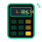
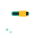
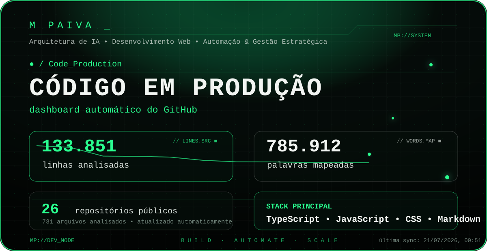

<!-- ╔══════════════════════════════════════════════════════════════╗
     ║  M PAIVA — GitHub Profile README                              ║
     ║  Desenvolvimento Web • IA Aplicada • Automação • SaaS         ║
     ╚══════════════════════════════════════════════════════════════╝ -->

<p align="center">
  
</p>

<p align="center">
  <samp><b>Full Stack Developer · IA Aplicada · SaaS</b> — São José dos Campos, SP</samp>
</p>

<p align="center">
  <a href="https://github.com/EoPaiva">
    
  </a>
</p>

<div align="center">

[](https://upaiva.dev/)
[](https://linkedin.com/in/mateus-paiva-19804b284)
[](mailto:mpaiiva21@gmail.com)

</div>

<p align="center">
  <samp>~/mpaiva $ ls&nbsp;&nbsp;<a href="#nav-whoami">whoami/</a>&nbsp;&nbsp;<a href="#nav-projetos">projetos/</a>&nbsp;&nbsp;<a href="#nav-stack">stack/</a>&nbsp;&nbsp;<a href="#nav-status">status/</a>&nbsp;&nbsp;<a href="#nav-contato">contato/</a></samp>
</p>

---

<a name="nav-whoami"></a>

## `whoami.json`

```js
const mateusPaiva = {
  nome:        "Mateus Paiva",
  funcao:      "Desenvolvedor Full Stack • IA Aplicada • Produto Digital",
  baseado:     "São José dos Campos — SP",
  foco:        ["Web Development", "SaaS", "Automação", "UX Estratégica"],
  objetivo:    "Transformar ideias em produtos profissionais, úteis e bem estruturados."
};
// → 10+ produtos digitais · 6 extensões publicadas na Chrome Web Store
```

Perfil híbrido entre **tecnologia, produto e pessoas** — uno visão técnica e pensamento estratégico para entregar produtos com clareza, performance e propósito.

---

<a name="nav-projetos"></a>

## `projetos_em_destaque = [`

<table>
  <tr>
    <td width="33%" valign="top">
      <h3> upaiva.dev</h3>
      <p>
        
      </p>
      <p><sub><b>Portfólio profissional interativo</b> — vitrine digital, branding e posicionamento estratégico, com modos Tech, RH e Cliente.</sub></p>
      <p>
        
        
        
        
      </p>
      <a href="https://upaiva.dev/">→ ver projeto</a>
    </td>
    <td width="33%" valign="top">
      <h3> Não Seguidores uPaiva</h3>
      <p>
        
        
      </p>
      <p><sub>Extensão Chrome (MV3) <b>freemium</b> que detecta quem não te segue no Instagram e faz unfollow em lote com delays seguros.</sub></p>
      <p>
        
        
        
        
      </p>
      <a href="https://chromewebstore.google.com/detail/n%C3%A3o-seguidores-upaiva/pggbblnnnofafnnieccbdopeaaafolin?hl=pt-br">
        
      </a>
      <details>
        <summary><sub><b>+ detalhes técnicos</b></sub></summary>
        <sub>
          <br>
          ▸ Popup com 4 abas (Capturar / Análise / Lista / Config)<br>
          ▸ Integração com a API interna do Instagram via cookies<br>
          ▸ Unfollow em lote com delay aleatório 5–11s<br>
          ▸ Backend Node.js + Supabase + RLS + Mercado Pago<br>
          ▸ Licença por e-mail · 2 devices · device token
        </sub>
      </details>
    </td>
    <td width="33%" valign="top">
      <h3> HumanReply AI</h3>
      <p>
        
        
      </p>
      <p><sub>Plataforma SaaS de <b>IA aplicada a atendimento, suporte e vendas B2B</b> — transforma conversas em respostas contextuais, seguras e no tom da empresa.</sub></p>
      <p>
        
        
        
      </p>
      <a href="https://contextual-chat-lab.vercel.app">→ ver projeto</a> · <a href="https://github.com/EoPaiva/contextual-chat-lab">repo</a>
      <details>
        <summary><sub><b>+ detalhes técnicos</b></sub></summary>
        <sub>
          <br>
          ▸ Reescrita por tom + detector de mensagens ruins<br>
          ▸ Memória e análise contextual de conversas<br>
          ▸ Central B2B com integrações via API/webhook<br>
          ▸ Relatórios, painel de QA e treinador de atendentes<br>
          ▸ Simulação visual 3D em tempo real
        </sub>
      </details>
    </td>
  </tr>
</table>

<br>

|  | Projeto | Status | Stack | Link |
|:--:|---------|:------:|-------|:----:|
|  | **InstaGrowth IA** — growth para Instagram com IA BYOK <sub>(repo privado)</sub> | 🟢 lançamento | MV3 · esbuild · Supabase | [instalar →](https://chromewebstore.google.com/detail/instagrowth-ia-upaiva/eopaifcdlgkmmpemkpkdklhaddgllbkc?hl=pt-br) |
|  | **Calc Impostos BR** — extensão Chrome de impostos brasileiros (IR, INSS, MEI) | 🟢 produção | MV3 · Node.js · Supabase | [instalar →](https://chromewebstore.google.com/detail/calculadora-de-impostos-b/cifdfcomjlidngiddbdnhmcakecggehh?utm_source=item-share-cb) |
|  | **Studio JMarq** — site comercial premium com microinterações | 🟢 produção | React · Tailwind · GSAP | [ver →](https://studiojmarq.com/) |
|  | **Nexus IA** — coach de League of Legends com bot Discord e IA <sub>(repo privado)</sub> | 🟡 desenvolvimento | NestJS · Riot API · Gemini | — |
|  | **AgendaPro** — SaaS de agendamento multiempresa | 🟡 desenvolvimento | Next.js · Supabase · PostgreSQL | [ver →](https://agenda-pro-eta.vercel.app/) |
|  | **CidadeOS AI** — govtech de atendimento e inteligência urbana | 🟡 desenvolvimento | React · Supabase · WhatsApp API | [ver →](https://cidade-os-ai.vercel.app/) |
|  | **FitPro** — SaaS de gestão fitness | ⚪ planejamento | Next.js · Supabase · Tailwind | [ver →](https://fit-pro-xp7c.vercel.app/) |

<p align="center">
  <a href="https://github.com/EoPaiva?tab=repositories">
    
  </a>
  &nbsp;
  <a href="https://upaiva.dev/">
    
  </a>
</p>

`]`

---

<a name="nav-stack"></a>

## `stack.config.ts`

```ts
const proficiency = {
  "🟢 production" : "usado em projetos reais entregues — base diária",
  "🟡 fluent"     : "domínio sólido aplicável em produção quando preciso",
  "🔵 expanding"  : "em aprendizado / próxima iteração técnica"
};
```

### `[ Frontend / Interface ]`

<p>
  <strong>🟢</strong>&nbsp;
  
  
  
  
  
  
  
  
  
  
  
  
  
  
  
  
  
</p>

<details>
  <summary><sub>🔵 expanding</sub></summary>
  <p>
    <strong>🔵</strong>&nbsp;
    
    
    
    
    
  </p>
</details>

### `[ Backend / Dados ]`

<p>
  <strong>🟢</strong>&nbsp;
  
  
  
  
  
  
  
  
  
  
  
  
  
  
  
  
</p>

<details>
  <summary><sub>🔵 expanding</sub></summary>
  <p>
    <strong>🔵</strong>&nbsp;
    
    
    
    
    
  </p>
</details>

### `[ AI / Automação ]`

<p>
  <strong>🟢</strong>&nbsp;
  
  
  
  
  
  
  
  
  
  
  
  
  
  
  
  
  
  
  
</p>

### `[ DevOps / Tooling ]`

<p>
  <strong>🟢</strong>&nbsp;
  
  
  
  
  
  
  
  
  
  
  
  
  
  
</p>

<details>
  <summary><sub>🔵 expanding</sub></summary>
  <p>
    <strong>🔵</strong>&nbsp;
    
    
    
    
  </p>
</details>

### `[ Produto / Estratégia ]`

<p>
  <strong>🟢</strong>&nbsp;
  
  
  
  
  
</p>

<details>
  <summary><sub>🟡 fluent · 🔵 expanding</sub></summary>
  <p>
    <strong>🟡</strong>&nbsp;
    
    
    
    
    
  </p>
  <p>
    <strong>🔵</strong>&nbsp;
    
    
    
    
  </p>
</details>

---

## `como_penso_um_projeto`

<p align="center">
  
</p>

---

## `codigo_em_producao`

<!-- CODE_DASHBOARD:START -->
<p align="center">
  
</p>
<!-- CODE_DASHBOARD:END -->

<p align="center">
  <sub>Painel gerado automaticamente a partir dos repositórios públicos do GitHub.</sub>
</p>

<table align="center" border="0" cellpadding="0" cellspacing="6">
  <tr>
    <td align="center" valign="middle">
      
    </td>
    <td align="center" valign="middle">
      
    </td>
  </tr>
</table>

---

<a name="nav-status"></a>

## `status_atual`

```txt
> Construindo presença profissional através de projetos reais.
> Unindo tecnologia, IA aplicada, automação e estratégia digital.
> Evoluindo HumanReply AI, Nexus IA e AgendaPro com foco em produto, SaaS e experiência.
> Aprendizado contínuo — código, design, gestão e visão de negócio.
```

---

<a name="nav-contato"></a>

## `contato`

<div align="center">

**Vamos conversar?**

[](https://upaiva.dev/)
[](https://linkedin.com/in/mateus-paiva-19804b284)
[](mailto:mpaiiva21@gmail.com)

</div>

---

<p align="center">
  <samp><i>"A tecnologia só atinge seu ápice quando guiada por estratégia clara, execução consistente e pessoas excepcionais."</i></samp>
</p>

<br>

<p align="center">
  
</p>

<p align="center">
  
</p>
