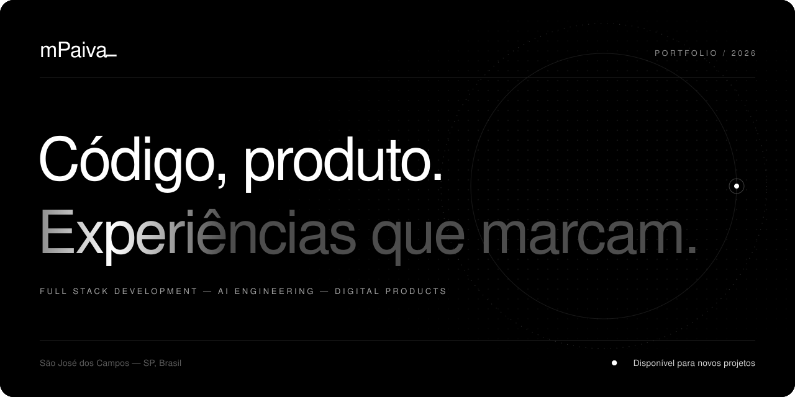
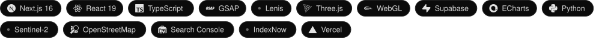
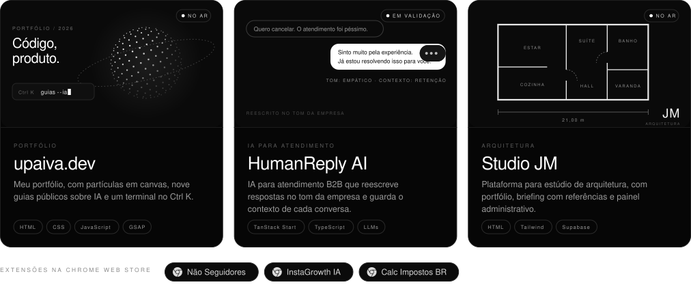

<!-- mPaiva_ · as animações são SVGs deste repositório, gerados por scripts/build-profile-assets.py -->

  

  <a href="https://upaiva.dev/"><b>upaiva.dev</b></a> &nbsp;·&nbsp;
  <a href="https://www.linkedin.com/in/mateuspaiva21/"><b>LinkedIn</b></a> &nbsp;·&nbsp;
  <a href="mailto:mpaiiva21@gmail.com"><b>E-mail</b></a> &nbsp;·&nbsp;
  <a href="#projetos"><b>Projetos</b></a>

## Oi, eu sou o Mateus.

Desenvolvedor full stack e engenheiro de IA em São José dos Campos, SP. Construo produtos do zero até o ar: interface, backend, banco de dados, integrações com IA e deploy. Meu foco é software que resolve um problema de verdade e que dá vontade de usar.

- **Sistemas web completos**, com login, painel administrativo, APIs e banco, publicados e em uso.
- **IA aplicada a produto:** agentes, RAG, LLMs com contexto e ferramentas como MCP, sempre com uma pessoa no controle das decisões.
- **Automação e ferramentas:** bots, extensões do Chrome e apps de desktop que tiram trabalho manual do caminho.
- **Sites que são encontrados:** SEO técnico, dados estruturados, sitemap e desempenho medido no celular.
- **Experiências 3D e interfaces com identidade:** maquetes em Three.js, animação, tipografia e detalhe, sem pesar a página.

### Como eu trabalho

| Princípio | Na prática |
|---|---|
| **Dado real em vez de ilustração** | A maquete da AZV nasce de relevo, foto de satélite e mapas abertos, com cada prédio no lote certo. |
| **Mostro o que o software faz** | Comando real de cada etapa, auditoria append-only e logs à vista, em vez de caixa-preta. |
| **IA com decisão humana** | No CHOQUE a IA analisa e quem decide é uma pessoa; no Instagram Fluxo ela é opcional e roda com a sua chave. |
| **Teste antes de prometer** | 1.036 testes automatizados no CHOQUE e um status honesto do que ainda falta testar no win-toolkit. |
| **Leve de propósito** | Um `.exe` de 106 KB sem runtime extra, uma extensão sem framework e um site em HTML, CSS e JavaScript. |

## Projetos em destaque

### [AZV Lançamentos](https://azvlancamentos.com.br) &nbsp;Plataforma imobiliária · no ar · meu maior projeto

  

A plataforma de lançamentos da AZV Imóveis em São José dos Campos, feita do zero, no ar e em uso no atendimento. É um produto completo, pensado para vender e para ser encontrado: vitrine, uma página rica para cada empreendimento, revista, SEO de ponta a ponta, painel próprio de dados e uma maquete 3D da cidade.

- **17 empreendimentos, cada um com página completa:** tipologias com cotas, lazer, plantas que se desenham e ampliam, localização com mapa que só carrega quando a pessoa pede, vídeos, books para baixar e contato com a corretora pelo WhatsApp, que já diz de qual prédio a pessoa veio.
- **Revista AZV:** 17 matérias em português e inglês, com capa de revista impressa, índice com filtro por tema e guias de bairro, de compra na planta e de leitura de planta, citando a lei quando o assunto pede.
- **SEO de ponta a ponta:** 92 páginas em português e inglês com hreflang, títulos e descrições medidos, dados estruturados (RealEstateAgent, FloorPlan, FAQPage, BreadcrumbList), sitemap com as fotos e a data real de cada mudança, páginas por bairro e por tamanho e IndexNow a cada publicação.
- **Rápido e acessível:** LCP de 0,8 s na home no celular com 4G lento, CLS 0 e nenhuma violação no axe, com modo escuro em todas as páginas e animações que respeitam quem prefere menos movimento.
- **Painel próprio, sem cookies de terceiros:** páginas, seções vistas, cliques, contatos e Core Web Vitals reais, a jornada de cada visita, a origem (Google, IA, WhatsApp), os leitores da revista, Search Console e PageSpeed integrados e links de campanha com QR code, com login por senha e código do celular.
- **Maquete 3D da cidade:** São José dos Campos e o litoral em Three.js, com relevo real, satélite e cerca de 320 mil casas, os 17 empreendimentos no lugar certo e maquetes de perto do Parque UNA, Ares, Senses e Pátio, a partir de dados do SRTM, Sentinel-2, Overture e OpenStreetMap.

  <a href="https://azvlancamentos.com.br"><b>Ver o site</b></a> &nbsp;·&nbsp;
  <a href="https://azvlancamentos.com.br/revista"><b>Ler a revista</b></a> &nbsp;·&nbsp;
  <a href="https://azvlancamentos.com.br/maquete"><b>Abrir a maquete 3D</b></a>

  

### [CHOQUE BGR](https://choquebgr.online) &nbsp;Sistema de gestão · no ar

  

Plataforma de gestão para uma unidade de roleplay, do Discord à web. Um bot faz cadastro, ponto por voz, carreira, disciplina e treinamentos só com botões, seletores e modais, sem nenhum comando de texto. Um centro de comando web com login Discord mostra tudo isso, e o recrutamento público aplica uma prova cronometrada no servidor.

- **Ponto por voz** com os estados `ACTIVE`, `GRACE`, `REVIEW_REQUIRED` e `CLOSED`, tolerância configurável e recuperação depois de reiniciar.
- **Recrutamento** com Discord OAuth, 24 questões balanceadas, autosave, timer no servidor e decisão final humana.
- **Confiável por padrão:** RBAC com cinco perfis, auditoria transacional com outbox, SQLite em WAL com migrations versionadas e mais de mil testes.

  

### [win-toolkit](https://github.com/EoPaiva/win-toolkit) &nbsp;App para Windows 11 · v1.5

  

Do Windows recém-formatado ao PC pronto para trabalhar, em uma tela só. Você escolhe o que entra, acompanha o comando real de cada etapa e sai com um relatório do que funcionou e do que não funcionou.

- **Instalar:** 24 dependências estilo AIO e um catálogo de 102 itens, com perfis prontos (Completo, Básico, Gamer, Dev e IA) e até quatro instalações em paralelo, conforme CPU e RAM.
- **Drivers e análise:** drivers do catálogo oficial do Windows Update com backup do anterior, e uma varredura somente leitura de Defender, Firewall, TPM, BitLocker e portas abertas.
- **Otimizar sem susto:** quatro níveis com mais de 170 ações, simulação antes de aplicar e ponto de restauração. Nenhum nível desliga Defender, Firewall ou Windows Update.

  

### [Instagram Fluxo](https://github.com/EoPaiva/instagram-fluxo) &nbsp;Extensão do Chrome · v3.1.3

  

Organiza quem você segue no Instagram com uma fila assistida. Lê as sugestões de três referências, segue só quem passa nas regras e para de seguir um perfil por vez, conferindo cada resultado no próprio perfil antes de avançar.

- **Ritmo seguro:** intervalos e pausas configuráveis, cota local de tentativas e pausa automática diante de qualquer aviso de restrição.
- **IA opcional com a sua chave:** fallback entre OpenAI, Claude, Gemini e OpenRouter, com as chaves num cofre local cifrado em AES-GCM.
- **Seus dados ficam com você:** fila, tentativas e histórico no navegador, e um coletor opcional para Windows que grava diagnósticos em JSONL.

  

## Também no ar

  

  <a href="https://upaiva.dev/"><b>upaiva.dev</b></a> &nbsp;·&nbsp;
  <a href="https://contextual-chat-lab.vercel.app"><b>HumanReply AI</b></a> &nbsp;·&nbsp;
  <a href="https://studiojmarq.com/"><b>Studio JM</b></a> &nbsp;·&nbsp;
  <a href="https://chromewebstore.google.com/detail/n%C3%A3o-seguidores-upaiva/pggbblnnnofafnnieccbdopeaaafolin?hl=pt-br">Não Seguidores</a> &nbsp;·&nbsp;
  <a href="https://chromewebstore.google.com/detail/instagrowth-ia-upaiva/eopaifcdlgkmmpemkpkdklhaddgllbkc?hl=pt-br">InstaGrowth IA</a> &nbsp;·&nbsp;
  <a href="https://chromewebstore.google.com/detail/calculadora-de-impostos-b/cifdfcomjlidngiddbdnhmcakecggehh">Calc Impostos BR</a>

## Stack

  

## Código em produção

Atualizado sozinho a cada seis horas por um workflow deste repositório.

<!-- CODE_DASHBOARD:START -->

  

<!-- CODE_DASHBOARD:END -->

## Vamos conversar

Aberto a projetos freelance e parcerias em produto digital, IA aplicada e automação. O caminho mais rápido é pelo [upaiva.dev](https://upaiva.dev/), pelo [LinkedIn](https://www.linkedin.com/in/mateuspaiva21/) ou por [e-mail](mailto:mpaiiva21@gmail.com).

mPaiva_ · São José dos Campos, SP · 2026

